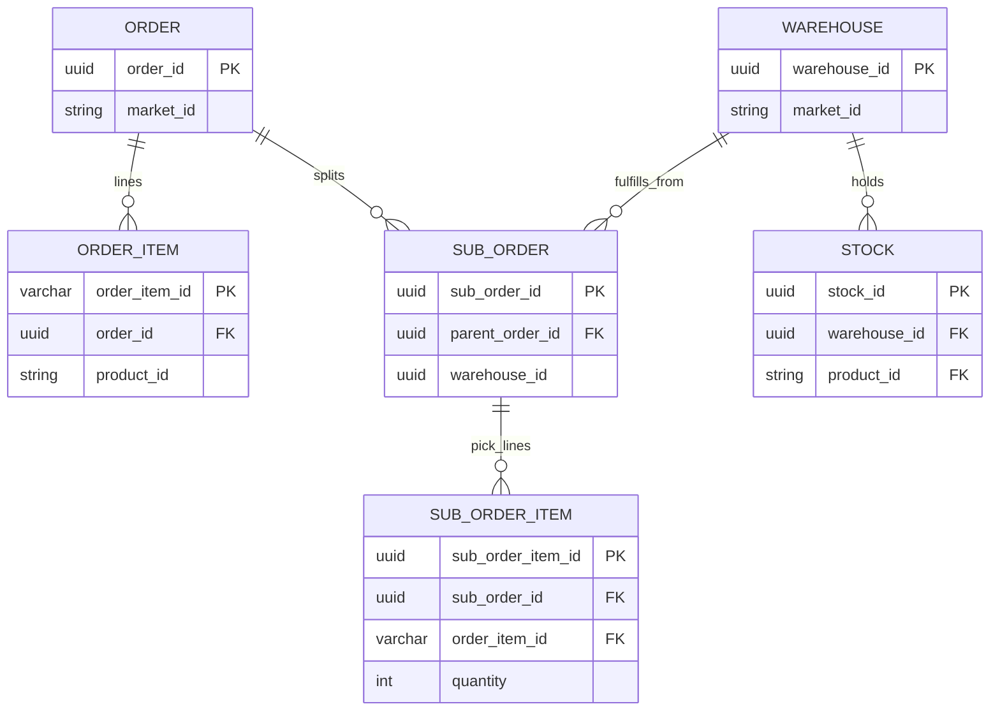

# Stock per magazzino, ordine per market, suborder per magazzino

## Obiettivo di dominio (allineato al feedback)

- **`Order`**: resta legato al **`market_id`** (punto vendita / contesto commerciale). Nessun `warehouse_id` sull’ordine.
- **`Stock`**: giacenza legata a **`Warehouse`** e **`Product`** (chiave logica **magazzino × prodotto**).
- **`SubOrder` e righe**: il lavoro di picking/evasione è **per magazzino** — collegare **suborder** (e, dove serve, **righe `SubOrderItem`**) al magazzino da cui si attinge la merce.

## UX / ruoli

| Ruolo | Comportamento atteso |
|--------|----------------------|
| **Operatore negozio** (crea / compila suborder) | Vede **solo gli stock dei magazzini «vicini»** al contesto negozio (definizione di «vicino» da modellare: sottoinsieme di warehouse del market, distanza, flag `front_store`, tabella di associazione negozio↔warehouse, ecc.). |
| **Operatore magazzino** | Vede i **suborder in stato pending** (o equivalente operativo) **filtrati per il proprio `warehouse_id`** (claim su JWT, header, o profilo utente collegato al magazzino). |

Questa parte richiede **API dedicate** (o query parametrizzate) oltre al solo schema DB: es. `GET /stock?warehouseIds=...` lato inventario, e `GET /sub-orders?physicalStatus=pending&warehouseId=...` lato order-service, più **autorizzazione** che limiti i `warehouseId` interrogabili.

## 1. Inventario (schema + servizio)

**[`Stock`](apps/inventory-service/src/app/database/entites/stock.ts)**

- `warehouseId` obbligatorio, **`ManyToOne` → `Warehouse`**, unicità **`(warehouse_id, product_id)`**.
- `marketId`: preferibile **derivare** da `warehouse.marketId` nelle query di servizio, oppure mantenerlo **denormalizzato** ma aggiornato in scrittura per non rompere filtri esistenti per market.

**[`StockMovement`](apps/inventory-service/src/app/database/entites/sotck_movement.ts)**

- `warehouseId` obbligatorio sui movimenti generati da reserve/release/scarico, per il rilascio corretto in [`releaseStockForOrder`](apps/inventory-service/src/app/inventory/stock/stock.service.ts).

**[`StockService`](apps/inventory-service/src/app/inventory/stock/stock.service.ts)**

- Tutte le operazioni su stock usano **`(warehouseId, productId)`** (non più solo `marketId` come chiave di riga).
- Validazione incrociata: `warehouse.marketId === order.marketId` quando l’order-service passa `marketId` + movimenti.

**Magazzini «vicini» (operatore negozio)**

- Se oggi non esiste un modello: introdurre una strategia minima documentata, ad esempio:
  - tabella **`store_warehouse_access`** (market + id negozio/logical store + `warehouse_id`), oppure
  - flag su **`Warehouse`** (`visibleFromShop: boolean`, `sortOrder`), oppure
  - lista configurabile per market.
- Esporre endpoint tipo **«stock disponibile per contesto negozio»** che accetta `marketId` + identità negozio (o user) e restituisce righe stock solo per i warehouse autorizzati.

## 2. Contratti RMQ e order-service

- Payload `checkAvailability` / `reserveStockForOrder` / `deductInstantSale`: ogni movimento con **`warehouseId`** (e `marketId` per validazione incrociata lato inventory).
- **`CommInventoryService`**: inoltrare i magazzini coerenti con i suborder/righe, non con un magazzino sull’`Order`.

**Order rimane senza warehouse** — nessuna colonna `warehouse_id` su [`Order`](apps/order-service/src/app/database/entities/order.ts).

**Suborder e righe**

- **[`SubOrder`](apps/order-service/src/app/database/entities/sub_order.ts)**: rendere **`warehouseId` obbligatorio** (dove il suborder è operativo / da evadere da un magazzino), con validazione già esistente `validateWarehouseForMarket` rispetto a `Order.marketId`.
- **Righe suborder**: due varianti implementative (sceglierne una e uniformare):
  - **A)** Solo `SubOrder.warehouseId`: tutte le `SubOrderItem` dello stesso suborder condividono il magazzino (più semplice; basta filtro pending per `sub_order.warehouse_id`).
  - **B)** Anche **`warehouse_id` su `SubOrderItem`**: utile se in futuro uno stesso documento suborder potesse attingere da più magazzini (più flessibile, query magazzino per riga). Se si sceglie B, vincolo consigliato: `SubOrderItem.warehouse_id` uguale al parent salvo eccezioni esplicitamente supportate.

**Scalaggio giacenza**

- **`_applyStockForOrder`** non deve assumere magazzino su `OrderItem` come unica fonte: costruire gli `items` per l’inventario da **suborder + righe** (quantità per `orderItemId` → risoluzione `productId` da `OrderItem`) e **`warehouseId`** dal suborder (o dalla riga, se variante B).
- Riallineare quando si riattiva la chiamata inventario in [`createOrder`](apps/order-service/src/app/order/order.service.ts) (oggi commentata).

## 3. Operatore magazzino: lista suborder pending

- Endpoint (HTTP o pattern RMQ) che elenca **`SubOrder`** con `physicalStatus` pending (o stato concordato) e **`warehouseId` = magazzino dell’operatore**.
- Guard: JWT o contesto utente con **`warehouseId`** (o lista) autorizzata; rifiutare query su altri magazzini.

## 4. Documentazione e migrazione

- Aggiornare **[`docs/database-er-diagrams.md`](docs/database-er-diagrams.md)** (Order–market, Stock–warehouse, SubOrder–warehouse, movimenti).
- Backfill: stock storici per `marketId` → assegnazione a un warehouse di default per market; suborder senza magazzino → valorizzazione o blocco fino a migrazione.

## 5. Test

- Stock indipendente per due warehouse sullo stesso product/market.
- Creazione suborder con `warehouseId` valido vs market; rifiuto se warehouse di altro market.
- Lista pending filtrata per warehouse + test negativo cross-warehouse.

## Rischio

- **`synchronize: true`**: stesso avviso su unicità e dati esistenti.
- Definizione di **«magazzini vicini»**: senza tabella o regole chiare, l’UI negozio non potrà filtrare in modo corretto; va inclusa nella stessa epic o come prerequisito minimo (anche mock con lista fissa per dev).
