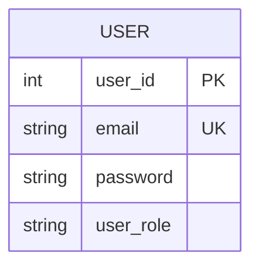
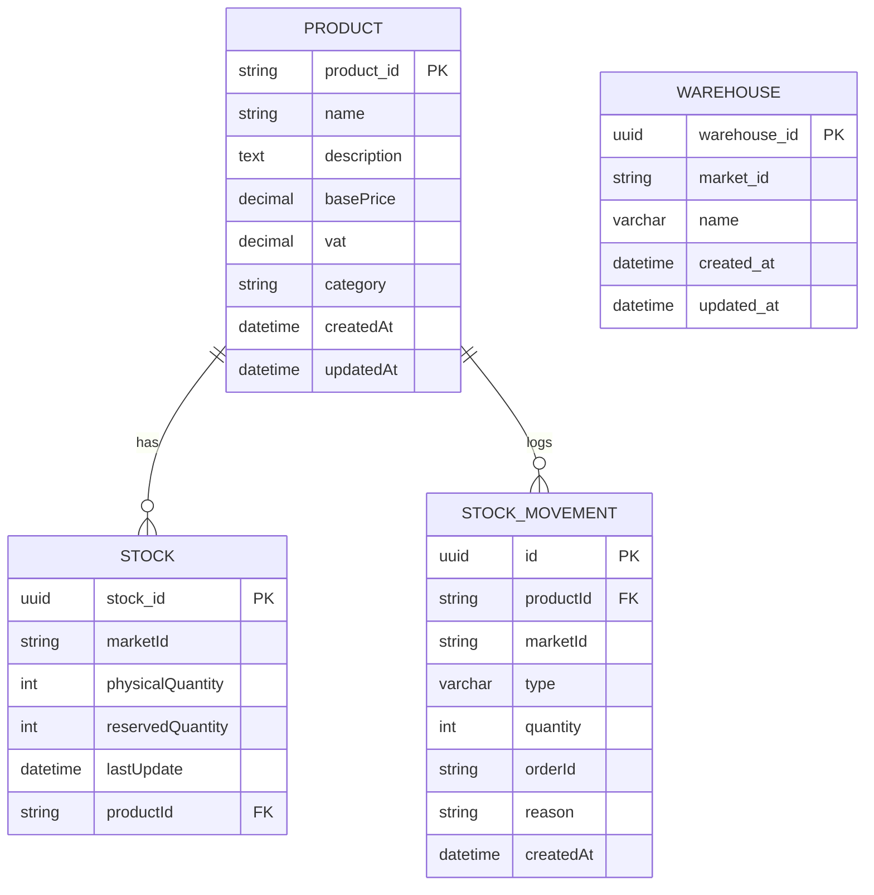
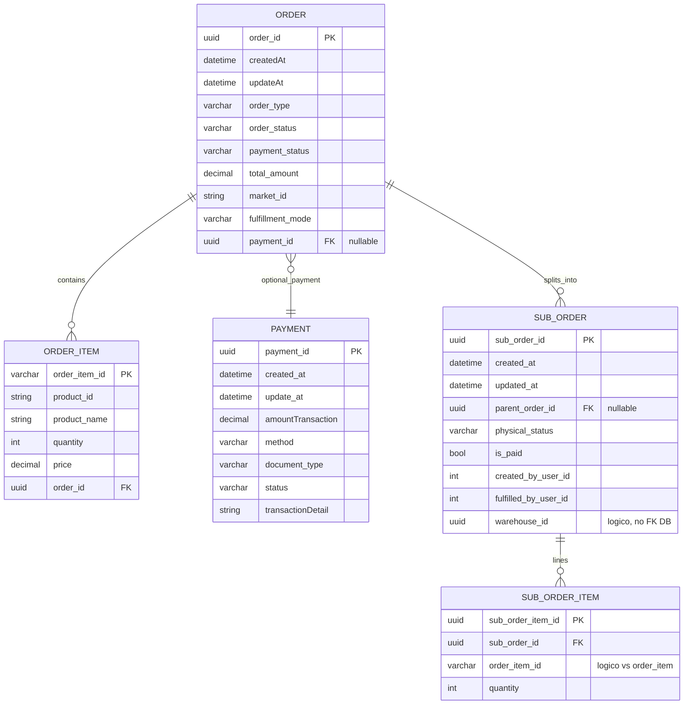

# Modelli ER per database dei microservizi

Documento generato a partire dalle entità TypeORM nel monorepo. L’**api-gateway** non persiste dati con entità dedicate.

Riferimenti al codice:

| Servizio | Percorso entità |
|----------|-----------------|
| auth-service | `apps/auth-service/src/app/database/entities/` |
| inventory-service | `apps/inventory-service/src/app/database/entites/` |
| order-service | `apps/order-service/src/app/database/entities/` |

---

## Auth-service

Tabella tipica TypeORM: `user` (nome di default per `@Entity()` senza nome).

---

## Inventory-service

Tabelle esplicite: `products`, `stock`, `stock_movements`, `warehouses`.

Relazioni TypeORM: **Product** 1:N **Stock**, **Product** 1:N **StockMovement**.

**Warehouse** non è collegata in TypeORM a `Stock` o `Product`. **Stock** e **StockMovement** usano `marketId` come stringa (nessuna FK verso `warehouses` nel modello attuale).

---

## Order-service

Tabelle: `order`, `order_item`, `payment`, `sub_orders`, `sub_order_items` (ultime due con nome esplicito in `@Entity`).

- **Order** → **Payment**: one-to-one; la FK `payment_id` è sulla tabella **order** (`@JoinColumn` sul lato Order).
- **SubOrderItem** referenzia `order_item_id` in modo logico (stesso valore di `OrderItem.orderItemId`), senza FK TypeORM tra le due tabelle.

---

## Riferimenti cross-servizio (non FK nel DB)

Questi campi collegano i domini a livello applicativo; non sono foreign key tra database distinti:

- `SubOrder.warehouseId` → magazzino nell’inventory-service (UUID opaco).
- `SubOrder.createdByUserId` / `fulfilledByUserId` → `User.userId` nell’auth-service.
- `StockMovement.orderId` → ordine nell’order-service (stringa opaca).
- `OrderItem.productId` / movimenti inventario → prodotto nell’inventory-service.

---

## Visualizzazione

I diagrammi usano [Mermaid](https://mermaid.js.org/). In GitHub/GitLab o in VS Code con estensione Mermaid si vedono come grafici ER.
