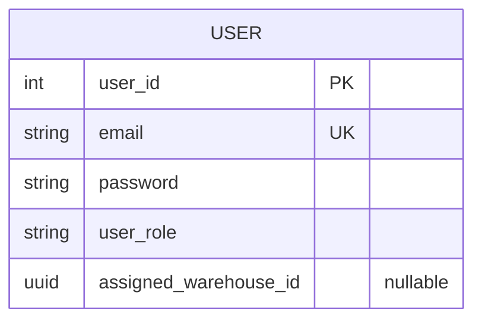
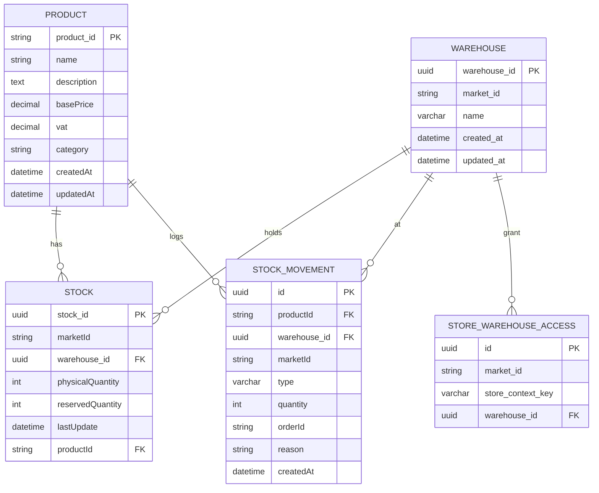
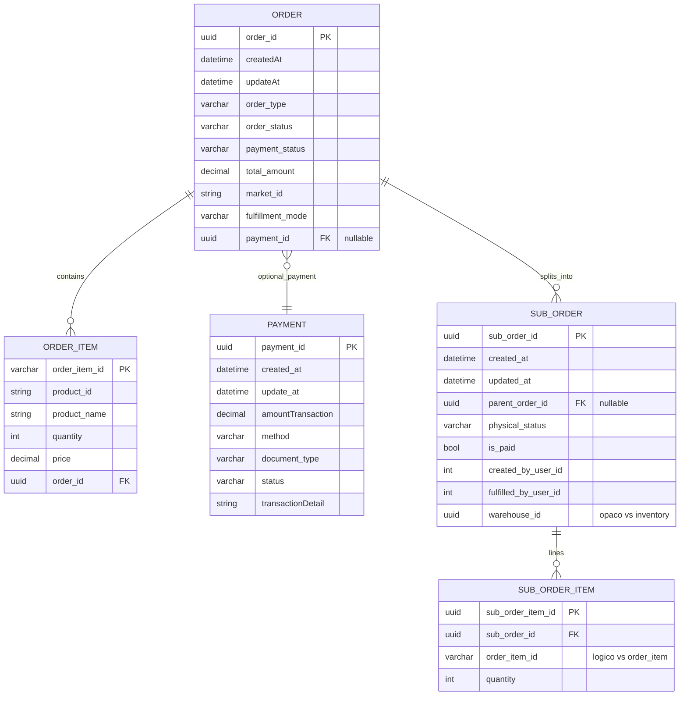

# Modelli ER per database dei microservizi

Documento generato a partire dalle entità TypeORM nel monorepo. L’**api-gateway** non persiste dati con entità dedicate.

Riferimenti al codice:

| Servizio | Percorso entità |
|----------|-----------------|
| auth-service | `apps/auth-service/src/app/database/entities/` |
| inventory-service | `apps/inventory-service/src/app/database/entites/` |
| order-service | `apps/order-service/src/app/database/entities/` |

---

## Auth-service

Tabella tipica TypeORM: `user` (nome di default per `@Entity()` senza nome).

`assigned_warehouse_id` (UUID, nullable) collega l’operatore magazzino a un magazzino nel contesto applicativo; non è una FK verso l’inventario (DB separato).

```mermaid
erDiagram
    USER {
        int user_id PK
        string email UK
        string password
        string user_role
        uuid assigned_warehouse_id "nullable"
    }
```

---

## Inventory-service

Tabelle: `products`, `stock`, `stock_movements`, `warehouses`, `store_warehouse_access`.

- **Stock**: chiave unica (magazzino × prodotto). `ManyToOne` verso **Warehouse**; `marketId` denormalizzato da `warehouse.marketId` in scrittura.
- **StockMovement**: `ManyToOne` verso **Warehouse**; `marketId` allineato al magazzino.
- **StoreWarehouseAccess**: associa `marketId` + `storeContextKey` (contesto negozio) a un **Warehouse** — usato per esporre agli operatori negozio solo i magazzini “vicini” / consentiti.

```mermaid
erDiagram
    PRODUCT {
        string product_id PK
        string name
        text description
        decimal basePrice
        decimal vat
        string category
        datetime createdAt
        datetime updatedAt
    }
    STOCK {
        uuid stock_id PK
        string marketId
        uuid warehouse_id FK
        int physicalQuantity
        int reservedQuantity
        datetime lastUpdate
        string productId FK
    }
    STOCK_MOVEMENT {
        uuid id PK
        string productId FK
        uuid warehouse_id FK
        string marketId
        varchar type
        int quantity
        string orderId
        string reason
        datetime createdAt
    }
    WAREHOUSE {
        uuid warehouse_id PK
        string market_id
        varchar name
        datetime created_at
        datetime updated_at
    }
    STORE_WAREHOUSE_ACCESS {
        uuid id PK
        string market_id
        varchar store_context_key
        uuid warehouse_id FK
    }

    WAREHOUSE ||--o{ STOCK : holds
    WAREHOUSE ||--o{ STOCK_MOVEMENT : at
    WAREHOUSE ||--o{ STORE_WAREHOUSE_ACCESS : grant
    PRODUCT ||--o{ STOCK : has
    PRODUCT ||--o{ STOCK_MOVEMENT : logs
```

---

## Order-service

Tabelle: `order`, `order_item`, `payment`, `sub_orders`, `sub_order_items` (ultime due con nome esplicito in `@Entity`).

- **Order** → **Payment**: one-to-one; la FK `payment_id` è sulla tabella **order** (`@JoinColumn` sul lato Order).
- **SubOrder.warehouseId**: riferimento opaco al magazzino nell’inventory-service (stesso UUID); obbligatorio in applicazione quando il suborder ha righe o serve movimentare giacenza.
- **SubOrderItem** referenzia `order_item_id` in modo logico (stesso valore di `OrderItem.orderItemId`), senza FK TypeORM tra le due tabelle.

`defaultWarehouseId` e `inventoryShopContextKey` compaiono solo nei DTO di creazione ordine (nessuna colonna su `order`).

```mermaid
erDiagram
    ORDER {
        uuid order_id PK
        datetime createdAt
        datetime updateAt
        varchar order_type
        varchar order_status
        varchar payment_status
        decimal total_amount
        string market_id
        varchar fulfillment_mode
        uuid payment_id FK "nullable"
    }
    ORDER_ITEM {
        varchar order_item_id PK
        string product_id
        string product_name
        int quantity
        decimal price
        uuid order_id FK
    }
    PAYMENT {
        uuid payment_id PK
        datetime created_at
        datetime update_at
        decimal amountTransaction
        varchar method
        varchar document_type
        varchar status
        string transactionDetail
    }
    SUB_ORDER {
        uuid sub_order_id PK
        datetime created_at
        datetime updated_at
        uuid parent_order_id FK "nullable"
        varchar physical_status
        bool is_paid
        int created_by_user_id
        int fulfilled_by_user_id
        uuid warehouse_id "opaco vs inventory"
    }
    SUB_ORDER_ITEM {
        uuid sub_order_item_id PK
        uuid sub_order_id FK
        varchar order_item_id "logico vs order_item"
        int quantity
    }

    ORDER ||--o{ ORDER_ITEM : contains
    ORDER ||--o{ SUB_ORDER : splits_into
    ORDER }o--|| PAYMENT : optional_payment
    SUB_ORDER ||--o{ SUB_ORDER_ITEM : lines
```

---

## Riferimenti cross-servizio (non FK nel DB)

Questi campi collegano i domini a livello applicativo; non sono foreign key tra database distinti:

- `SubOrder.warehouseId` → `Warehouse.warehouseId` nell’inventory-service.
- `User.assignedWarehouseId` → stesso UUID magazzino per operatori magazzino (JWT).
- `SubOrder.createdByUserId` / `fulfilledByUserId` → `User.userId` nell’auth-service.
- `StockMovement.orderId` → ordine nell’order-service (stringa opaca).
- `OrderItem.productId` → prodotto nell’inventory-service.

---

## Visualizzazione

I diagrammi usano [Mermaid](https://mermaid.js.org/). In GitHub/GitLab o in VS Code con estensione Mermaid si vedono come grafici ER.
